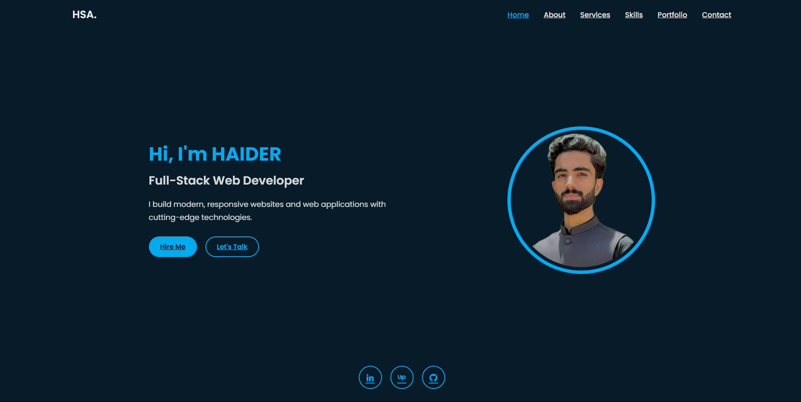

# 🖼️ Personal Portfolio – React

This is a responsive and modern personal portfolio website built with **React**.  
It showcases my projects, skills, and experience as an **architect & builder**.

---

## 📸 Preview

 

## ✨ Features
- Clean, minimalist design
- Built with **React** and modern CSS
- Fully responsive for desktop, tablet, and mobile
- Smooth navigation & scroll animations
- Sections for:
  - About Me
  - Projects / Work
  - Skills & Services
  - Contact

---

## ⚙️ Technologies Used
- React
- JavaScript (ES6+)
- CSS / SCSS
- HTML5
- [React Router](https://reactrouter.com/) (if used)

---

## 🚀 Getting Started

To run the project locally:

```bash
# Clone this repository
git clone https://github.com/HSA-ATTOCK/portfolio-react.git

# Navigate into the folder
cd portfolio-react

# Install dependencies
npm install

# Start the development server
npm start
````

Then open [http://localhost:3000](http://localhost:3000) to view it in your browser.

---

## 📦 Build for Production

```bash
npm run build
```

The optimized build will be in the `/build` folder, ready to deploy.

---

## 📄 License

This project is licensed under the **MIT License**.

---

## 🙋‍♂️ Author

**HSA-Attock**
Full-Stack Web Developer and Designer

* GitHub: [HSA-ATTOCK](https://github.com/HSA-ATTOCK)

---

> ⭐ *If you like this project, please consider giving it a star!*

```
